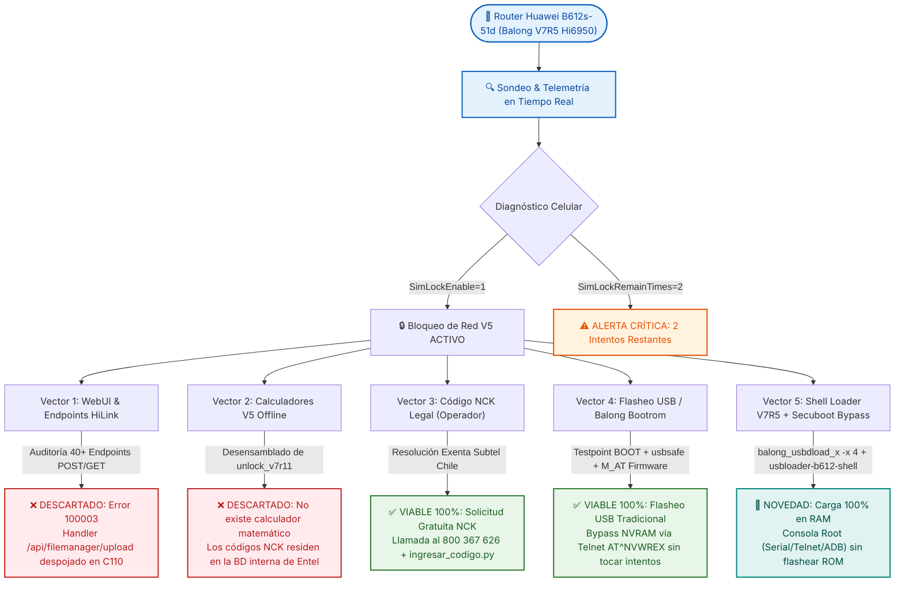
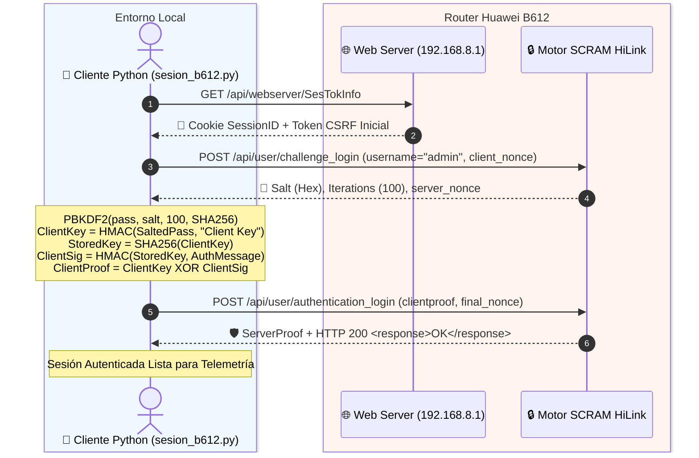
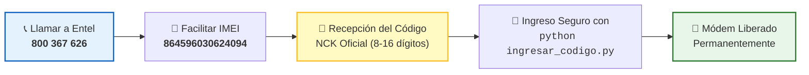

<div align="center">

```
  ██████╗  ██████╗  ██╗██████╗     ██╗   ██╗███╗   ██╗██╗      ██████╗  ██████╗██╗  ██╗
  ██╔══██╗██╔════╝ ███║╚════██╗    ██║   ██║████╗  ██║██║     ██╔═══██╗██╔════╝██║ ██╔╝
  ██████╔╝███████╗ ╚██║ █████╔╝    ██║   ██║██╔██╗ ██║██║     ██║   ██║██║     █████═╝ 
  ██╔══██╗██╔═══██╗ ██║██╔═══╝     ██║   ██║██║╚██╗██║██║     ██║   ██║██║     ██╔═██╗ 
  ██████╔╝╚██████╔╝ ██║███████╗    ╚██████╔╝██║ ╚████║███████╗╚██████╔╝╚██████╗██║  ██╗
  ╚═════╝  ╚═════╝  ╚═╝╚══════╝     ╚═════╝ ╚═╝  ╚═══╝╚══════╝ ╚═════╝  ╚═════╝╚═╝  ╚═╝
```

### 🔓 Suite Integral de Auditoría, Ingeniería Inversa y Desbloqueo de Red (SIM-Lock V5)
**Huawei 4G Router B612s-51d (SoC HiSilicon Balong V7R5 / Hi6950 • Entel Chile CUST-C110)**

---

[](https://github.com/davidarellano210322-glitch/huawei-b612-unlock)
[-7928CA?style=for-the-badge&logo=arm&logoColor=white)](https://github.com/davidarellano210322-glitch/huawei-b612-unlock)
[-FF8000?style=for-the-badge&logo=huawei&logoColor=white)](https://github.com/davidarellano210322-glitch/huawei-b612-unlock)
[](https://github.com/davidarellano210322-glitch/huawei-b612-unlock)
[-FF0055?style=for-the-badge&logo=gnu-bash&logoColor=white)](./documentacion/08_EXPLOIT_SECUBOOT_Y_ECOSISTEMA_BALONG.md)
[](./documentacion/09_SHELL_LOADER_V7R5_Y_BACKUP_NVRAM.md)
[-00DF89?style=for-the-badge&logo=auth0&logoColor=black)](https://github.com/davidarellano210322-glitch/huawei-b612-unlock)
[](https://github.com/davidarellano210322-glitch/huawei-b612-unlock)

<br/>

| [⚡ Inicio Rápido](#-inicio-r%C3%A1pido) | [📊 Telemetría](#-telemetr%C3%ADa-y-estado-en-vivo) | [🐚 Shell Loader](#-shell-loader-v7r5-autónomo-en-ram) | [📚 Dossier Técnico](#-dossier-documental-completo-cap%C3%ADtulos-01-al-09) | [🚀 Métodos Viables](#-rutas-de-desbloqueo-100-verificadas) | [🗂️ Documentación](./documentacion/README.md) |
| :---: | :---: | :---: | :---: | :---: | :---: |

---

</div>

## 🎯 Resumen Ejecutivo y Alcance

Este proyecto comprende una **auditoría integral de seguridad, telemetría en tiempo real, desensamblado binario, análisis de exploits de BootROM, construcción de Shell Loaders en RAM y desarrollo de herramientas de bajo nivel** sobre el router 4G LTE **Huawei B612s-51d** bloqueado por defecto para la compañía **Entel Chile**.

El propósito central es dotar a la comunidad técnica de una guía concluyente que permita liberar el dispositivo para su uso en redes celulares de operadores alternativos (**WOM, Movistar, Claro**) sin riesgo de dañar la partición NVRAM y sin agotar los intentos de desbloqueo.

---

## 🗺️ Mapa de Decisión y Árbol de Resolución de Vectores



---

## 📊 Telemetría y Estado en Vivo

Al insertar una tarjeta SIM del operador **WOM** en el router, los scripts de telemetría extraen el estado real de los subsistemas del módem:

```ini
[HARDWARE_INFO]
Device_Model        = Huawei B612s-51d
SoC_Architecture    = HiSilicon Balong V7R5 (Hi6950 / V700R500C31B195 / V700R500C31B201)
IMEI_Identifier     = 864596030624094
Firmware_Version    = 11.192.00.00.110
Carrier_Custom      = CUST-B00C110 (Entel Chile)
WebUI_Build         = 11.100.01.00.110 (Stripped Release)
Supported_Bands     = LTE FDD B2 (1900), B4 (AWS), B7 (2600), B28 (700 MHz)

[CELLULAR_STATUS]
SimState            = 257  [SIM Presente y Lista - Sin PIN requerido]
SimLockEnable       = 1    [Bloqueo de Operador ACTIVO]
SimLockVersion      = 5    [Algoritmo Criptográfico Huawei V5]
SimLockRemainTimes  = 2    [⚠️ CRÍTICO: Solo 2 de 10 intentos disponibles]
ConnectionStatus    = 902  [Desconectado por restricción de red]
NetworkType         = 0    [Sin Registro Celular permitido]
PLMN_Status         = ""   [Denegado acceso a red 73009 (WOM)]
```

---

## 📚 Dossier Documental Completo (Capítulos 01 al 09)

Toda la investigación se encuentra desglosada en **9 documentos técnicos especializados** dentro de la carpeta [`documentacion/`](./documentacion/):

| Capítulo | Módulo Documental | Temas Clave Tratados | Acceso Directo |
| :---: | :--- | :--- | :---: |
| **01** | **Estado del Dispositivo y Diagnóstico** | Ficha técnica, IMEI `864596030624094`, bandas FDD LTE, protocolo SCRAM-SHA256 y lectura en vivo de la SIM WOM (`SimState=257`, `SimLockRemainTimes=2`). | [📖 Ver Cap. 01](./documentacion/01_ESTADO_DEL_DISPOSITIVO.md) |
| **02** | **Análisis e Ingeniería Inversa** | Desmontaje de `unlock_v7r11` (Setup Factory / ADB), análisis de algoritmos SIM-Lock V1 a V5, deconstrucción de `inst_webui` y firmwares M_AT. | [📖 Ver Cap. 02](./documentacion/02_ANALISIS_REVERSE_ENGINEERING.md) |
| **03** | **Auditoría de Seguridad WebUI** | Escaneo de puertos (23, 80, 443, 5510, 5555), auditoría de 40+ endpoints HiLink y diagnóstico del error `100003` en la subida multipart. | [📖 Ver Cap. 03](./documentacion/03_AUDITORIA_WEBUI_Y_ENDPOINTS.md) |
| **04** | **Guías de Desbloqueo Viables** | Manuales de ejecución: (A) Flasheo USB por Testpoint BOOT + M_AT + Telnet; (B) Procedimiento legal Subtel para NCK gratuito oficial. | [📖 Ver Cap. 04](./documentacion/04_GUIAS_DE_DESBLOQUEO_VIABLES.md) |
| **05** | **Catálogo de Scripts y Herramientas** | Documentación de la suite en Python (`sesion_b612.py`, `desbloquear_b612.py`, `ingresar_codigo.py`, `webui_update.py`, etc.). | [📖 Ver Cap. 05](./documentacion/05_CATALOGO_SCRIPTS_HERRAMIENTAS.md) |
| **06** | **Cronología e Historial de Avances** | Bitácora cronológica de 6 fases: autenticación SCRAM, detección crítica de intentos, auditoría web, hallazgos y cierre. | [📖 Ver Cap. 06](./documentacion/06_CRONOLOGIA_E_HISTORIAL_INVESTIGACION.md) |
| **07** | **Fuentes, Referencias y Créditos** | Referencias de 4PDA (forth32, rust33, aomsk), comunidad Capa9 Chile, instructivo oficial UCSC/Entel y normativa Subtel. | [📖 Ver Cap. 07](./documentacion/07_FUENTES_Y_REFERENCIAS.md) |
| **08** | **Exploit Secuboot y Ecosistema Balong** | PotatoNV vs Balong, análisis del exploit BootROM `balong-usbdload -x 4`, parche SRAM en `0x1001FFEC` y mapa NVRAM `nvid.c`. | [📖 Ver Cap. 08](./documentacion/08_EXPLOIT_SECUBOOT_Y_ECOSISTEMA_BALONG.md) |
| **09** | **Shell Loader V7R5 y Backup NVRAM** | Construcción de `usbloader-b612-shell.bin`, initramfs con busybox estático, dump real del ítem 8268 y procedimiento de backup vía fastboot. | [📖 Ver Cap. 09](./documentacion/09_SHELL_LOADER_V7R5_Y_BACKUP_NVRAM.md) |
| **10** | **Prueba de Shell Loader en Hardware** | Guía práctica de inyección de bootloader en RAM con `-x 4` sobre el B612 real: testpoint, consolas y diagnóstico. | [📖 Ver Cap. 10](./documentacion/10_PRUEBA_SHELL_LOADER_EN_HARDWARE.md) |
| **11** | **Verificación Forense de unlock_v7r11** | Análisis forense de `unlock_v7r11`: se confirma que NO contiene algoritmo V5 — es un cliente ADB de escritura NVRAM. | [📖 Ver Cap. 11](./documentacion/11_VERIFICACION_UNLOCK_V7R11.md) |
| **12** | **Auditoría Avanzada de Vectores de Software** | Auditoría en vivo de SCRAM Huawei (inversión de claves), fuzzing de inyección de diagnóstico y análisis de TR-069/CWMP. | [📖 Ver Cap. 12](./documentacion/12_AUDITORIA_AVANZADA_VECTORES_SOFTWARE.md) |

---

## 🐚 Shell Loader V7R5 Autónomo en RAM

Se diseñó e implementó [`kit_flasheo/usbloader-b612-shell.bin`](./kit_flasheo/usbloader-b612-shell.bin), un cargador de arranque en RAM que **no escribe en la memoria flash** y expone consolas de depuración directa (**UART Serial, Telnet y ADB**) utilizando un *initramfs* autónomo con `busybox` estático extraído del firmware `M_AT`:

```
   ┌────────────────────────────────────────────────────────────────────────┐
   │                   ESTRUCTURA DEL SHELL LOADER V7R5                     │
   │                                                                        │
   │   [ Header usbldr / fastboot ] ───> ptable V7R500_CPE                  │
   │   [ Bootimg ANDROID! @0x5c508 ]                                        │
   │       ├── Kernel zImage ARM (0x5971e0 bytes gzip) [Intacto]            │
   │       └── Ramdisk Nuevo (1.29 MB gzip / 2.31 MB cpio)                  │
   │           ├── /init -> symlink a busyboxx                              │
   │           ├── /bin/busyboxx (ARM estático 2.19 MB)                     │
   │           ├── /bin/adbd     (ARM estático 117 KB)                      │
   │           ├── /etc/inittab  (Consola en ttyAMA0 @115200)               │
   │           └── /etc/init.d/rcS (Monta proc/sys y lanza telnetd :23)     │
   │   [ Cola Cifrada del Loader ] ────> Preservada byte a byte (Round-trip)│
   └────────────────────────────────────────────────────────────────────────┘
```

### Ejecución con Exploit Secuboot (`-x 4`):
```cmd
cd kit_flasheo
balong_usbdload_x.exe -x 4 usbloader-b612-shell.bin
```
* **Serial (UART):** `ttyAMA0 @ 115200`
* **Telnet:** Puerto `23` (IP LAN del router)
* **ADB:** `adb connect 192.168.8.1:5555` $\rightarrow$ `adb shell`

---

## 🗄️ Decodificación Real del Item 8268 (`CardlockStatus`)

Mediante análisis directo con `balong-nvtool` sobre la partición NVRAM extraída del firmware **Balong V700R500C31B201**, se verificó la estructura binaria exacta del registro `8268`:

```
-- Item # 8268: 12 bytes (3 × uint32_t Little Endian) --
00000000: 00 00 00 00 02 00 00 00 0A 00 00 00
```

| Campo (Offset) | Descripción | Estado Fábrica | Estado Bloqueado | Escritura de Desbloqueo |
| :---: | :--- | :---: | :---: | :---: |
| **0x00 (Word 0)** | Switch Cardlock (0=Off, 1=On) | `0x00000000` | `0x00000001` | `0x00000001` |
| **0x04 (Word 1)** | **Estado (1=Bloqueado, 2=Desbloqueado)** | `0x00000002` | `0x00000001` | **`0x00000002`** |
| **0x08 (Word 2)** | Intentos Restantes / Máximos | `0x0000000A` (10) | `0x0000000A` (10) | `0x0000000A` (10) |

> **Confirmación Técnica:** El comando `atc at^nvwrex=8268,0,12,1,0,0,0,2,0,0,0,a,0,0,0` cambia el estado de la palabra 1 de `01` a `02` y restaura los reintentos a 10.

---

## 💾 Procedimiento de Backup Completo de NVRAM

Para resguardar el IMEI, número de serie y calibración de radiofrecuencia antes de cualquier modificación:

```bash
# 1. Cargar usbsafe con exploit de secuboot:
balong_usbdload_x.exe -x 4 usbsafe-b612.bin

# 2. Respaldar particiones NVRAM vía balong-fbtools (Fastboot):
python3 fbtool.py -p COM33 dump nvimg nvimg.bin
python3 fbtool.py -p COM33 dump nvdload nvdload.bin
python3 fbtool.py -p COM33 dump nvdefault nvdefault.bin
python3 fbtool.py -p COM33 dump oeminfo oeminfo.bin
```

---

## 🔐 Protocolo Criptográfico SCRAM-SHA256 (HiLink V5)

El router implementa autenticación estricta bajo la norma **RFC 5802** (**SCRAM-SHA256**). El cliente autónomo [`sesion_b612.py`](./sesion_b612.py) resuelve el handshake en dos fases:



---

## 🚀 Rutas de Desbloqueo 100% Verificadas

### 🛠️ RUTA A: Flasheo USB por Testpoint (Método de la Aguja)
* **Objetivo:** Instalar firmware con servidor Telnet/ADB activo (`M_AT`) y anular el bloqueo en la partición NVRAM.
* **Ventaja:** **No consume los 2 intentos de NCK restantes.**

```
   ┌────────────────────────────────────────────────────────────────────────┐
   │                     ESQUEMA DE TESTPOINT (MODO BOOT)                   │
   │                                                                        │
   │   [ PCB Huawei B612s-51d ]                                             │
   │                                                                        │
   │       ┌──────────────┐          ┌──────────────────────┐               │
   │       │   CHIP SoC   │          │  Punto BOOT (Pad) ●──┼──────┐        │
   │       │  Hi6950 V7R5 │          └──────────────────────┘      │ (Puente│
   │       └──────────────┘                                        │  Pinza)│
   │                                 ┌──────────────────────┐      │        │
   │       [ Blindaje Metálico ] ────┤  GND (Tierra)     ●──┼──────┘        │
   │                                 └──────────────────────┘               │
   └────────────────────────────────────────────────────────────────────────┘
```

#### Paso a Paso:
1. **Instalar Drivers:** Ejecutar los instaladores en [`kit_flasheo/drivers/`](./kit_flasheo/drivers/) e importar `Windows10_fix.reg`.
2. **Entrar en Modo BOOT (Download):**
   * Retirar corriente, abrir carcasa y puentear el pad **BOOT** con **GND**.
   * Conectar USB a la PC, conectar corriente por 3 segundos y soltar el puente.
   * Verificar en el *Administrador de Dispositivos* el puerto `HUAWEI Mobile Connect - 3G PC UI Interface` (VID_12D1 & PID_1443).
3. **Cargar Bootloader de Emergencia:**
   ```cmd
   cd kit_flasheo
   balong_usbdload.exe usbsafe-b612.bin
   ```
4. **Flashear Firmware Modificado M_AT:**
   ```cmd
   balong_flash.exe -gd B612_UPDATE_81.201.01.01.234_sec_M_AT_V3.9.bin
   ```
5. **Inyección de Comando NVRAM por Telnet:**
   Conectar el router por cable LAN (192.168.8.1) y ejecutar:
   ```bash
   python desbloquear_b612.py
   ```
   *(Comando despachado: `atc at^nvwrex=8268,0,12,1,0,0,0,2,0,0,0,a,0,0,0`)*

---

### 🏛️ RUTA B: Vía Legal Oficial (Código NCK Gratuito Entel)
* **Objetivo:** Obtener el código NCK original registrado en los servidores de Entel al momento de la fabricación del router.
* **Marco Legal:** **Normativa de Desbloqueo de Equipos Terminales Móviles de la SUBTEL (Chile)** — El desbloqueo es gratuito, inmediato e irrenunciable.



---

## 🧰 Catálogo de Scripts y Herramientas

| Script / Herramienta | Lenguaje / Tipo | Función Principal | Comando de Ejecución |
| :--- | :---: | :--- | :--- |
| [`kit_flasheo/balong_usbdload_x.exe`](./kit_flasheo/balong_usbdload_x.exe) | C / Win32 | Cargador con Exploit Secuboot Bypass (`-x 4`) | `balong_usbdload_x.exe -x 4 loader.bin` |
| [`kit_flasheo/usbloader-b612-shell.bin`](./kit_flasheo/usbloader-b612-shell.bin) | Binario Bootloader | Shell Loader V7R5 autónomo en RAM con Busybox | Cargar vía `balong_usbdload_x.exe` |
| [`shell_loader/construir_shell.py`](./shell_loader/construir_shell.py) | Python 3 | Generador y reempaquetador del Shell Loader V7R5 | `python shell_loader/construir_shell.py` |
| [`sesion_b612.py`](./sesion_b612.py) | Python 3 | Motor de autenticación HiLink SCRAM-SHA256 | `python sesion_b612.py` |
| [`desbloquear_b612.py`](./desbloquear_b612.py) | Python 3 | Cliente Telnet para anulación de SIM-Lock en NVRAM | `python desbloquear_b612.py` |
| [`ingresar_codigo.py`](./ingresar_codigo.py) | Python 3 | Inyector seguro de NCK con validación de intentos | `python ingresar_codigo.py <CODIGO>` |
| [`webui_update.py`](./webui_update.py) | Python 3 | Emulador de subida multipart `/api/filemanager/upload` | `python webui_update.py --probe` |
| [`sonda_b612.py`](./sonda_b612.py) | Python 3 | Extractor completo de telemetría del módem | `python sonda_b612.py` |
| [`endpoints_b612.py`](./endpoints_b612.py) | Python 3 | Auditor y escáner de endpoints HiLink bajo sesión | `python endpoints_b612.py` |
| [`balong-nvtool`](./balong-nvtool/) | C / Win32 | Extractor, visor y editor de particiones NVRAM | `balong-nvtool.exe -d 8268 nv.bin` |

---

## 🗂️ Estructura Completa del Repositorio

```
huawei-b612-unlock/
├── README.md                                    # 📖 Hub principal y presentación técnica
├── historial                                    # 📋 Resumen rápido y bitácora del router
├── .gitignore                                   # 🚫 Filtro de binarios y temporales
├── documentacion/                               # 📚 Suite Documental Exhaustiva
│   ├── README.md                                # 📑 Índice general del dossier
│   ├── 01_ESTADO_DEL_DISPOSITIVO.md             # 📱 Ficha técnica, IMEI y telemetría WOM
│   ├── 02_ANALISIS_REVERSE_ENGINEERING.md       # 🔬 Desmontaje unlock_v7r11 y NVRAM
│   ├── 03_AUDITORIA_WEBUI_Y_ENDPOINTS.md        # 🛡️ Mapeo 40+ endpoints y error 100003
│   ├── 04_GUIAS_DE_DESBLOQUEO_VIABLES.md        # 🚀 Manuales paso a paso de desbloqueo
│   ├── 05_CATALOGO_SCRIPTS_HERRAMIENTAS.md      # 🛠️ Documentación detallada de scripts
│   ├── 06_CRONOLOGIA_E_HISTORIAL_INVESTIGACION.md # 📅 Bitácora día a día de la investigación
│   ├── 07_FUENTES_Y_REFERENCIAS.md              # 🌐 Créditos 4PDA, Capa9, Subtel y UCSC
│   ├── 08_EXPLOIT_SECUBOOT_Y_ECOSISTEMA_BALONG.md # 🧬 Exploit BootROM -x, PotatoNV y NVRAM nvid
│   └── 09_SHELL_LOADER_V7R5_Y_BACKUP_NVRAM.md   # 🐚 Shell Loader V7R5 y verificación real ítem 8268
├── kit_flasheo/                                 # 🧰 Toolchain de Flasheo USB Balong
│   ├── balong_flash.exe                         # Flasheador de bajo nivel
│   ├── balong_usbdload.exe                      # Cargador de arranque en RAM clásico
│   ├── balong_usbdload_x.exe                    # Cargador con exploit Secuboot Bypass (-x 4)
│   ├── usbsafe-b612.bin                         # Bootloader seguro para B612
│   ├── usbloader-b612-shell.bin                 # Shell Loader V7R5 autónomo en RAM
│   ├── README_PASOS.txt                         # Manual de comandos para flasheo
│   └── drivers/                                 # Controladores USB y Fix para Win 10/11
├── shell_loader/                                # 🐚 Entorno de construcción de Shell Loader
│   ├── construir_shell.py                       # Constructor y reempaquetador de bootimg
│   ├── analizar_bootimg.py                      # Analizador de offsets y headers cpio/gzip
│   └── raiz/                                    # Plantillas de inittab, rcS, profile y default.prop
└── [Scripts Python...]                          # 🐍 Motores de sesión, diagnóstico y desbloqueo
```

---

## ⚠️ Advertencias de Seguridad Críticas

> [!CAUTION]
> **No ingresar códigos al azar ni por fuerza bruta:**
> El módem cuenta únicamente con **2 intentos restantes** (`SimLockRemainTimes = 2`). Ingresar 2 códigos erróneos provocará el bloqueo permanente del contador (*hard-lock*), inhabilitando para siempre la entrada por software de códigos NCK.

> [!WARNING]
> **No realizar Factory Reset post-desbloqueo:**
> Si el router es liberado mediante el método de escritura en NVRAM (`AT^NVWREX=8268...`), realizar un restablecimiento de fábrica desde el botón físico o la interfaz web corromperá el registro de calibración, ocasionando la pérdida de la señal celular.

---

## 📚 Créditos y Agradecimientos

* **Comunidad 4PDA (Rusia):** A los desarrolladores *forth32*, *rust33*, *aomsk*, *Valikov* y *ValdikSS* por sus investigaciones en la arquitectura Balong V7R5 (Hi6950) y el desarrollo de las herramientas `balong_flash`, `balong_usbdload` y el exploit de BootROM.
* **Comunidad Huawei-LTE-routers-mods:** Por la documentación y mantenimiento del mapa de registros NVRAM (`nvid.c`).
* **Proyecto PotatoNV (kitsuned):** Por la inspiración arquitectónica del método de inyección Testpoint en plataformas HiSilicon.
* **Comunidad Capa9 (Chile):** Al usuario *gonzalo bahia* por la documentación de los puntos de testpoint en placas B612 de Entel Chile.
* **Universidad Católica de la Santísima Concepción (UCSC):** Por la preservación del instructivo oficial de habilitación de BAM B612 de Entel.
* **SUBTEL (Subsecretaría de Telecomunicaciones de Chile):** Por el marco normativo que garantiza el derecho al desbloqueo libre de equipos.

---

<div align="center">

**Desarrollado con propósitos de investigación técnica, interoperabilidad y preservación de hardware • 2026**

</div>
