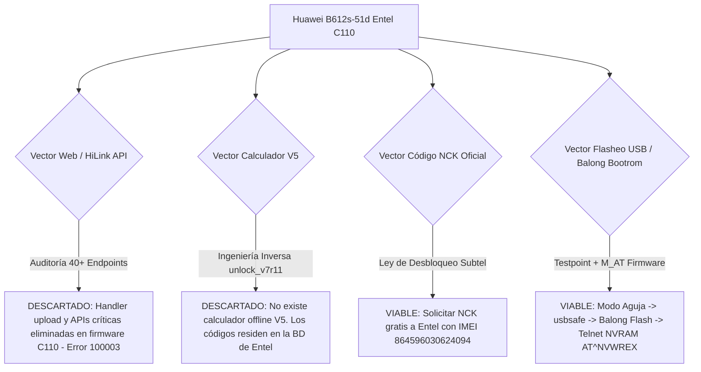

# 📡 Investigación y Desarrollo: Desbloqueo Huawei B612s-51d (Entel Chile)

> **Proyecto:** Análisis de Seguridad, Ingeniería Inversa y Métodos de Desbloqueo de Red (SIM-Lock V5) para Router 4G LTE Huawei B612s-51d (Compilación CUST-C110 de Entel Chile).

---

## 📌 Resumen Ejecutivo

Este repositorio contiene la documentación técnica exhaustiva, ingeniería inversa, scripts de diagnóstico y guías de procedimiento resultantes de la investigación sobre el router **Huawei B612s-51d** bloqueado para la red de **Entel Chile**.

El objetivo principal fue determinar la viabilidad de desbloquear el dispositivo para utilizar operadores alternativos (ej. WOM, Movistar, Claro) preservando la integridad del módem y sin agotar los intentos restantes de desbloqueo.

---

## 📊 Ficha Técnica del Dispositivo Bajo Prueba

| Parámetro | Valor / Estado Detectado |
| :--- | :--- |
| **Modelo** | Huawei B612s-51d |
| **Plataforma / Chipset** | HiSilicon Balong 711 (V7R11) |
| **IMEI** | `864596030624094` |
| **Firmware Base** | `11.192.00.00.110` (Entel CUST-B00C110) |
| **Versión SIM-Lock** | **V5** (`SimLockVersion=5`) |
| **Estado SIM-Lock** | **Activo / Bloqueado** (`SimLockEnable=1`) |
| **Intentos Restantes** | **2 intentos** (`SimLockRemainTimes=2`) ⚠️ **CRÍTICO** |
| **SIM Probada** | WOM (`SimState=257`, `ConnectionStatus=902`, Sin registro PLMN) |
| **Autenticación Web** | HiLink SCRAM-SHA256 (RFC 5802 con Client Proof & Server Proof) |

---

## 🗂️ Estructura de la Documentación

La documentación se divide en los siguientes módulos especializados:

1. 📄 **[01_ESTADO_DEL_DISPOSITIVO.md](documentacion/01_ESTADO_DEL_DISPOSITIVO.md)**  
   *Detalle técnico de hardware, firmware C110, estructura de memoria, protocolo SCRAM-SHA256 y lectura en vivo de la SIM.*

2. 🔬 **[02_ANALISIS_REVERSE_ENGINEERING.md](documentacion/02_ANALISIS_REVERSE_ENGINEERING.md)**  
   *Ingeniería inversa de herramientas rusas (`unlock_v7r11`), desmitificación de algoritmos V5, análisis de paquetes CPIO, firmware modificado M_AT y extracción de rootfs SquashFS.*

3. 🛡️ **[03_AUDITORIA_WEBUI_Y_ENDPOINTS.md](documentacion/03_AUDITORIA_WEBUI_Y_ENDPOINTS.md)**  
   *Auditoría de seguridad sobre más de 40 endpoints HiLink, pruebas de inyección multipart `/api/filemanager/upload`, análisis de ruteo y diagnóstico del error 100003.*

4. 🚀 **[04_GUIAS_DE_DESBLOQUEO_VIABLES.md](documentacion/04_GUIAS_DE_DESBLOQUEO_VIABLES.md)**  
   *Las 2 rutas de desbloqueo 100% viables: (A) Flasheo USB Testpoint con kit Balong + M_AT + comando NVRAM; (B) Procedimiento legal Subtel para obtención del NCK oficial de Entel.*

5. 🛠️ **[05_CATALOGO_SCRIPTS_HERRAMIENTAS.md](documentacion/05_CATALOGO_SCRIPTS_HERRAMIENTAS.md)**  
   *Documentación de todos los scripts desarrollados en Python (`desbloquear_b612.py`, `sesion_b612.py`, `webui_update.py`, `ingresar_codigo.py`, etc.).*

6. 📅 **[06_CRONOLOGIA_E_HISTORIAL_INVESTIGACION.md](documentacion/06_CRONOLOGIA_E_HISTORIAL_INVESTIGACION.md)**  
   *Bitácora cronológica completa paso a paso: pruebas realizadas, hipótesis formuladas, bloqueos encontrados y hallazgos concluyentes.*

7. 📚 **[07_FUENTES_Y_REFERENCIAS.md](documentacion/07_FUENTES_Y_REFERENCIAS.md)**  
   *Repositorios, hilos de 4PDA, archivos de Telegram, instructivos oficiales de Entel / UCSC y documentación legal de Subtel Chile.*

---

## ⚠️ Advertencias de Seguridad Críticas

> [!CAUTION]
> **Intentos de NCK limitados (2/10 restantes):**
> Nunca introducir códigos al azar ni calculados con herramientas genéricas en la interfaz web. Dos códigos erróneos bloquearán permanentemente el contador del módem (`SimLockRemainTimes=0`), inhabilitando el ingreso de códigos NCK.

> [!WARNING]
> **No realizar Factory Reset post-desbloqueo por NVRAM:**
> Si el router es desbloqueado mediante el método de modificación de NVRAM (`AT^NVWREX=8268...`), realizar un restablecimiento de fábrica desde el botón físico o la interfaz web corromperá el registro de calibración, perdiendo la conectividad celular.

---
*Documentación generada para registro de avances en GitHub.*
