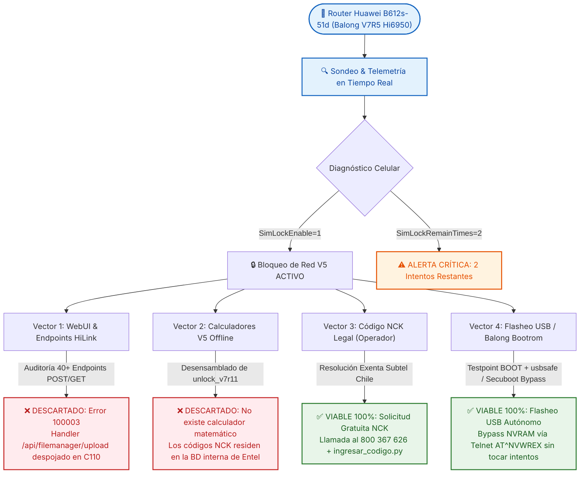
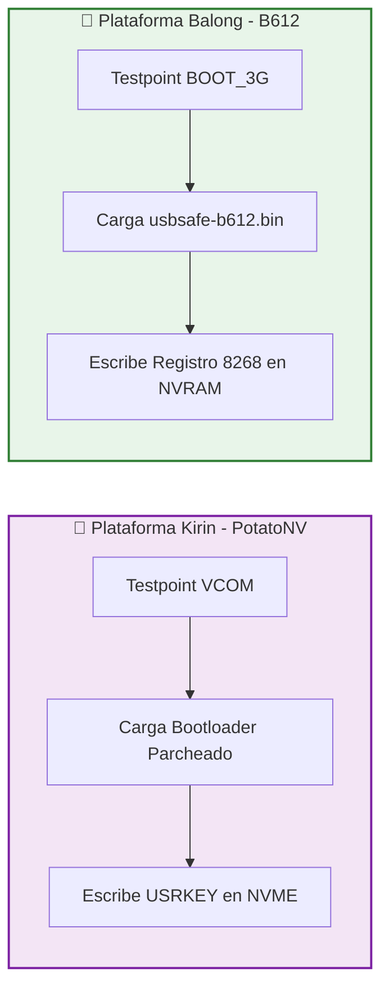
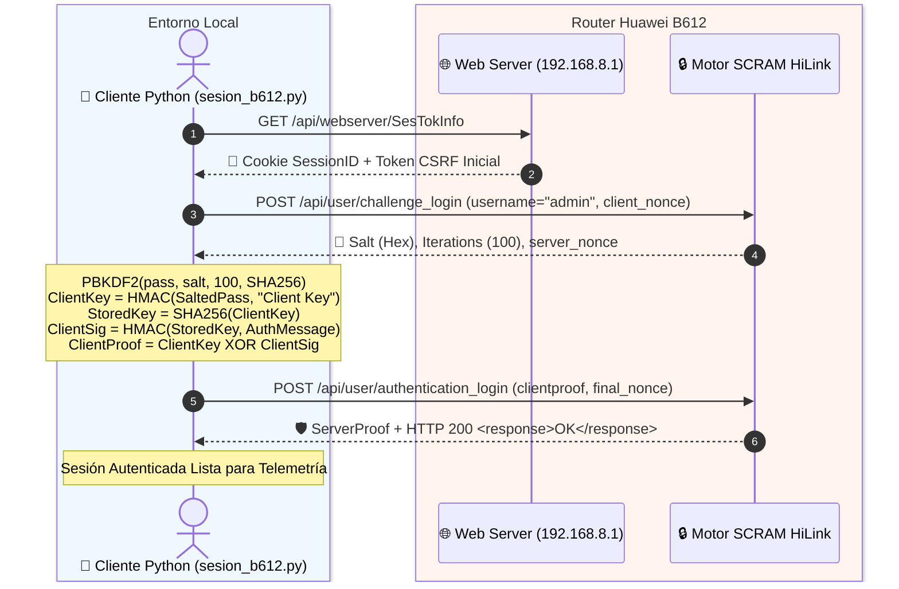
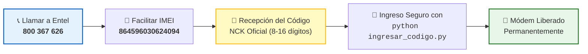

<div align="center">

```
  ██████╗  ██████╗  ██╗██████╗     ██╗   ██╗███╗   ██╗██╗      ██████╗  ██████╗██╗  ██╗
  ██╔══██╗██╔════╝ ███║╚════██╗    ██║   ██║████╗  ██║██║     ██╔═══██╗██╔════╝██║ ██╔╝
  ██████╔╝███████╗ ╚██║ █████╔╝    ██║   ██║██╔██╗ ██║██║     ██║   ██║██║     █████═╝ 
  ██╔══██╗██╔═══██╗ ██║██╔═══╝     ██║   ██║██║╚██╗██║██║     ██║   ██║██║     ██╔═██╗ 
  ██████╔╝╚██████╔╝ ██║███████╗    ╚██████╔╝██║ ╚████║███████╗╚██████╔╝╚██████╗██║  ██╗
  ╚═════╝  ╚═════╝  ╚═╝╚══════╝     ╚═════╝ ╚═╝  ╚═══╝╚══════╝ ╚═════╝  ╚═════╝╚═╝  ╚═╝
```

### 🔓 Suite Integral de Auditoría, Ingeniería Inversa y Desbloqueo de Red (SIM-Lock V5)
**Huawei 4G Router B612s-51d (SoC HiSilicon Balong V7R5 / Hi6950 • Entel Chile CUST-C110)**

---

[](https://github.com/davidarellano210322-glitch/huawei-b612-unlock)
[-7928CA?style=for-the-badge&logo=arm&logoColor=white)](https://github.com/davidarellano210322-glitch/huawei-b612-unlock)
[-FF8000?style=for-the-badge&logo=huawei&logoColor=white)](https://github.com/davidarellano210322-glitch/huawei-b612-unlock)
[](https://github.com/davidarellano210322-glitch/huawei-b612-unlock)
[-FF0055?style=for-the-badge&logo=gnu-bash&logoColor=white)](./documentacion/08_EXPLOIT_SECUBOOT_Y_ECOSISTEMA_BALONG.md)
[-00DF89?style=for-the-badge&logo=auth0&logoColor=black)](https://github.com/davidarellano210322-glitch/huawei-b612-unlock)
[](https://github.com/davidarellano210322-glitch/huawei-b612-unlock)

<br/>

| [⚡ Inicio Rápido](#-inicio-r%C3%A1pido) | [📊 Telemetría en Vivo](#-telemetr%C3%ADa-y-estado-en-vivo) | [🔬 Ingeniería Inversa](#-an%C3%A1lisis-de-ingenier%C3%ADa-inversa) | [🧬 Exploit Secuboot](#-exploit-de-bootrom-secuboot-bypass-y-comparaci%C3%B3n-potatonv) | [🚀 Métodos Viables](#-rutas-de-desbloqueo-100-verificadas) | [🗂️ Documentación](./documentacion/README.md) |
| :---: | :---: | :---: | :---: | :---: | :---: |

---

</div>

## 🎯 Resumen Ejecutivo y Alcance

Este proyecto comprende una **auditoría integral de seguridad, telemetría en tiempo real, desensamblado binario, análisis de exploits de BootROM y desarrollo de herramientas de bajo nivel** sobre el router 4G LTE **Huawei B612s-51d** bloqueado por defecto para la compañía **Entel Chile**.

El propósito central es dotar a la comunidad técnica de una guía concluyente que permita liberar el dispositivo para su uso en redes celulares de operadores alternativos (**WOM, Movistar, Claro**) sin riesgo de dañar la partición NVRAM y sin agotar los intentos de desbloqueo.

---

## 🗺️ Mapa de Decisión y Árbol de Resolución de Vectores



---

## 📊 Telemetría y Estado en Vivo

Al insertar una tarjeta SIM del operador **WOM** en el router, los scripts de telemetría extraen el estado real de los subsistemas del módem:

```ini
[HARDWARE_INFO]
Device_Model        = Huawei B612s-51d
SoC_Architecture    = HiSilicon Balong V7R5 (Hi6950 / V700R500C31B195)
IMEI_Identifier     = 864596030624094
Firmware_Version    = 11.192.00.00.110
Carrier_Custom      = CUST-B00C110 (Entel Chile)
WebUI_Build         = 11.100.01.00.110 (Stripped Release)
Supported_Bands     = LTE FDD B2 (1900), B4 (AWS), B7 (2600), B28 (700 MHz)

[CELLULAR_STATUS]
SimState            = 257  [SIM Presente y Lista - Sin PIN requerido]
SimLockEnable       = 1    [Bloqueo de Operador ACTIVO]
SimLockVersion      = 5    [Algoritmo Criptográfico Huawei V5]
SimLockRemainTimes  = 2    [⚠️ CRÍTICO: Solo 2 de 10 intentos disponibles]
ConnectionStatus    = 902  [Desconectado por restricción de red]
NetworkType         = 0    [Sin Registro Celular permitido]
PLMN_Status         = ""   [Denegado acceso a red 73009 (WOM)]
```

---

## 🧬 Exploit de BootROM (Secuboot Bypass) y Comparación PotatoNV

### 📱 PotatoNV vs. Ecosistema Balong
[PotatoNV](https://github.com/kitsuned/PotatoNV) es la reconocida herramienta de desbloqueo de bootloader para SoCs **Huawei Kirin** (teléfonos). Aunque PotatoNV no soporta directamente el chipset Balong, la filosofía de explotación es exactamente homóloga:



### ⚡ El Exploit `balong-usbdload -x 4` (ValdikSS / forth32)
El repositorio de bajo nivel [`forth32/balong-usbdload`](https://github.com/forth32/balong-usbdload) incluye el exploit **Secuboot Bypass (`-x`)** con soporte directo para la familia **Balong V7R5 (Hi6950)** de nuestro B612:

```c
// secuboot_exploit_v7r5() - forth32/balong-usbdload
// Plataforma objetivo: Hi6950 (B612s, B618s, B715s)
// Parchea 0x1001FFEC (SRAM) escribiendo 8 bytes de ceros -> ANULA LA VERIFICACIÓN DE FIRMA
```

### 🗄️ Base de Datos de Registros NVRAM (`balong-nvtool / nvid.c`)
La ingeniería inversa de la comunidad (`Huawei-LTE-routers-mods`) documenta los ítems clave de la NVRAM:
* **Item 8267:** `CustomizeSimLockPlmnInfo` (Lista de PLMNs autorizados).
* **Item 8268:** `CardlockStatus` (**Registro exacto modificado por `AT^NVWREX=8268...`**).
* **Item 8269:** `CustomizeSimLockMaxTimes` (Contador de intentos máximos).
* **Item 8517:** `ENHANCE_SIMCARD_LOCK_STATUS` (Estado de bloqueo avanzado).
* **Item 8518:** `GENHANCE_SIMCARD_REMAIN_TIMES` (Contador de intentos restantes).

> Para un análisis profundo de este exploit y la estructura de SRAM, consulta [08_EXPLOIT_SECUBOOT_Y_ECOSISTEMA_BALONG.md](./documentacion/08_EXPLOIT_SECUBOOT_Y_ECOSISTEMA_BALONG.md).

---

## 🔐 Protocolo Criptográfico SCRAM-SHA256 (HiLink V5)

El router implementa autenticación estricta bajo la norma **RFC 5802** (**SCRAM-SHA256**). El cliente autónomo [`sesion_b612.py`](./sesion_b612.py) resuelve el handshake en dos fases:



---

## 🚀 Rutas de Desbloqueo 100% Verificadas

### 🛠️ RUTA A: Flasheo USB por Testpoint (Método de la Aguja)
* **Objetivo:** Instalar firmware con servidor Telnet/ADB activo (`M_AT`) y anular el bloqueo en la partición NVRAM.
* **Ventaja:** **No consume los 2 intentos de NCK restantes.**

```
   ┌────────────────────────────────────────────────────────────────────────┐
   │                     ESQUEMA DE TESTPOINT (MODO BOOT)                   │
   │                                                                        │
   │   [ PCB Huawei B612s-51d ]                                             │
   │                                                                        │
   │       ┌──────────────┐          ┌──────────────────────┐               │
   │       │   CHIP SoC   │          │  Punto BOOT (Pad) ●──┼──────┐        │
   │       │  Hi6950 V7R5 │          └──────────────────────┘      │ (Puente│
   │       └──────────────┘                                        │  Pinza)│
   │                                 ┌──────────────────────┐      │        │
   │       [ Blindaje Metálico ] ────┤  GND (Tierra)     ●──┼──────┘        │
   │                                 └──────────────────────┘               │
   └────────────────────────────────────────────────────────────────────────┘
```

#### Paso a Paso:
1. **Instalar Drivers:** Ejecutar los instaladores en [`kit_flasheo/drivers/`](./kit_flasheo/drivers/) e importar `Windows10_fix.reg`.
2. **Entrar en Modo BOOT (Download):**
   * Retirar corriente, abrir carcasa y puentear el pad **BOOT** con **GND**.
   * Conectar USB a la PC, conectar corriente por 3 segundos y soltar el puente.
   * Verificar en el *Administrador de Dispositivos* el puerto `HUAWEI Mobile Connect - 3G PC UI Interface` (VID_12D1 & PID_1443).
3. **Cargar Bootloader de Emergencia:**
   ```cmd
   cd kit_flasheo
   balong_usbdload.exe usbsafe-b612.bin
   ```
4. **Flashear Firmware Modificado M_AT:**
   ```cmd
   balong_flash.exe -gd B612_UPDATE_81.201.01.01.234_sec_M_AT_V3.9.bin
   ```
5. **Inyección de Comando NVRAM por Telnet:**
   Conectar el router por cable LAN (192.168.8.1) y ejecutar:
   ```bash
   python desbloquear_b612.py
   ```
   *(Comando despachado: `atc at^nvwrex=8268,0,12,1,0,0,0,2,0,0,0,a,0,0,0`)*

---

### 🏛️ RUTA B: Vía Legal Oficial (Código NCK Gratuito Entel)
* **Objetivo:** Obtener el código NCK original registrado en los servidores de Entel al momento de la fabricación del router.
* **Marco Legal:** **Normativa de Desbloqueo de Equipos Terminales Móviles de la SUBTEL (Chile)** — El desbloqueo es gratuito, inmediato e irrenunciable.



---

## 🧰 Catálogo de Scripts y Herramientas

| Script / Herramienta | Lenguaje / Tipo | Función Principal | Comando de Ejecución |
| :--- | :---: | :--- | :--- |
| [`sesion_b612.py`](./sesion_b612.py) | Python 3 | Motor de autenticación HiLink SCRAM-SHA256 | `python sesion_b612.py` |
| [`desbloquear_b612.py`](./desbloquear_b612.py) | Python 3 | Cliente Telnet para anulación de SIM-Lock en NVRAM | `python desbloquear_b612.py` |
| [`ingresar_codigo.py`](./ingresar_codigo.py) | Python 3 | Inyector seguro de NCK con validación de intentos | `python ingresar_codigo.py <CODIGO>` |
| [`webui_update.py`](./webui_update.py) | Python 3 | Emulador de subida multipart `/api/filemanager/upload` | `python webui_update.py --probe` |
| [`sonda_b612.py`](./sonda_b612.py) | Python 3 | Extractor completo de telemetría del módem | `python sonda_b612.py` |
| [`endpoints_b612.py`](./endpoints_b612.py) | Python 3 | Auditor y escáner de endpoints HiLink bajo sesión | `python endpoints_b612.py` |
| [`ports_deep.py`](./ports_deep.py) | Python 3 | Escáner de puertos TCP y servicios locales | `python ports_deep.py` |
| [`simwatch.py`](./simwatch.py) | Python 3 | Monitor continuo de eventos SIM | `python simwatch.py` |
| [`kit_flasheo/`](./kit_flasheo/) | Binarios C / Win32 | Cadena de herramientas Balong (`usbdload`, `flash`, drivers) | Ver [`kit_flasheo/README_PASOS.txt`](./kit_flasheo/README_PASOS.txt) |

---

## 🗂️ Estructura Completa del Repositorio

```
huawei-b612-unlock/
├── README.md                                    # 📖 Hub principal y presentación técnica
├── historial                                    # 📋 Resumen rápido y bitácora del router
├── .gitignore                                   # 🚫 Filtro de binarios y temporales
├── documentacion/                               # 📚 Suite Documental Exhaustiva
│   ├── README.md                                # 📑 Índice general del dossier
│   ├── 01_ESTADO_DEL_DISPOSITIVO.md             # 📱 Ficha técnica, IMEI y telemetría WOM
│   ├── 02_ANALISIS_REVERSE_ENGINEERING.md       # 🔬 Desmontaje unlock_v7r11 y NVRAM
│   ├── 03_AUDITORIA_WEBUI_Y_ENDPOINTS.md        # 🛡️ Mapeo 40+ endpoints y error 100003
│   ├── 04_GUIAS_DE_DESBLOQUEO_VIABLES.md        # 🚀 Manuales paso a paso de desbloqueo
│   ├── 05_CATALOGO_SCRIPTS_HERRAMIENTAS.md      # 🛠️ Documentación detallada de scripts
│   ├── 06_CRONOLOGIA_E_HISTORIAL_INVESTIGACION.md # 📅 Bitácora día a día de la investigación
│   ├── 07_FUENTES_Y_REFERENCIAS.md              # 🌐 Créditos 4PDA, Capa9, Subtel y UCSC
│   └── 08_EXPLOIT_SECUBOOT_Y_ECOSISTEMA_BALONG.md # 🧬 Exploit BootROM -x, PotatoNV y NVRAM nvid
├── kit_flasheo/                                 # 🧰 Toolchain de Flasheo USB Balong
│   ├── balong_flash.exe                         # Flasheador de bajo nivel
│   ├── balong_usbdload.exe                      # Cargador de arranque en RAM
│   ├── Balong_USB_Downloader_1.0.1.10.exe       # GUI de flasheo
│   ├── usbsafe-b612.bin                         # Bootloader seguro para B612
│   ├── README_PASOS.txt                         # Manual de comandos para flasheo
│   └── drivers/                                 # Controladores USB y Fix para Win 10/11
└── [Scripts Python...]                          # 🐍 Motores de sesión, diagnóstico y desbloqueo
```

---

## ⚠️ Advertencias de Seguridad Críticas

> [!CAUTION]
> **No ingresar códigos al azar ni por fuerza bruta:**
> El módem cuenta únicamente con **2 intentos restantes** (`SimLockRemainTimes = 2`). Ingresar 2 códigos erróneos provocará el bloqueo permanente del contador (*hard-lock*), inhabilitando para siempre la entrada por software de códigos NCK.

> [!WARNING]
> **No realizar Factory Reset post-desbloqueo:**
> Si el router es liberado mediante el método de escritura en NVRAM (`AT^NVWREX=8268...`), realizar un restablecimiento de fábrica desde el botón físico o la interfaz web corromperá el registro de calibración, ocasionando la pérdida de la señal celular.

---

## 📚 Créditos y Agradecimientos

* **Comunidad 4PDA (Rusia):** A los desarrolladores *forth32*, *rust33*, *aomsk*, *Valikov* y *ValdikSS* por sus investigaciones en la arquitectura Balong V7R5 (Hi6950) y el desarrollo de las herramientas `balong_flash`, `balong_usbdload` y el exploit de BootROM.
* **Comunidad Huawei-LTE-routers-mods:** Por la documentación y mantenimiento del mapa de registros NVRAM (`nvid.c`).
* **Proyecto PotatoNV (kitsuned):** Por la inspiración arquitectónica del método de inyección Testpoint en plataformas HiSilicon.
* **Comunidad Capa9 (Chile):** Al usuario *gonzalo bahia* por la documentación de los puntos de testpoint en placas B612 de Entel Chile.
* **Universidad Católica de la Santísima Concepción (UCSC):** Por la preservación del instructivo oficial de habilitación de BAM B612 de Entel.
* **SUBTEL (Subsecretaría de Telecomunicaciones de Chile):** Por el marco normativo que garantiza el derecho al desbloqueo libre de equipos.

---

<div align="center">

**Desarrollado con propósitos de investigación técnica, interoperabilidad y preservación de hardware • 2026**

</div>
