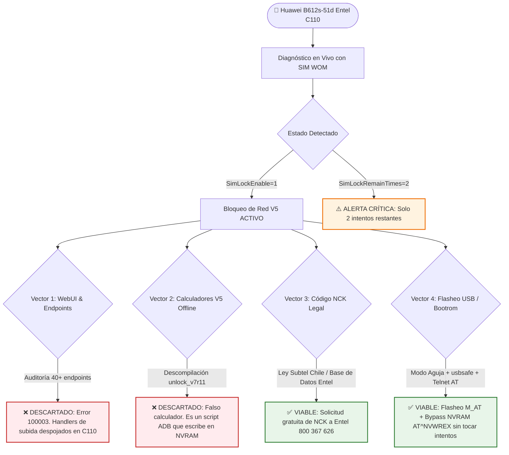
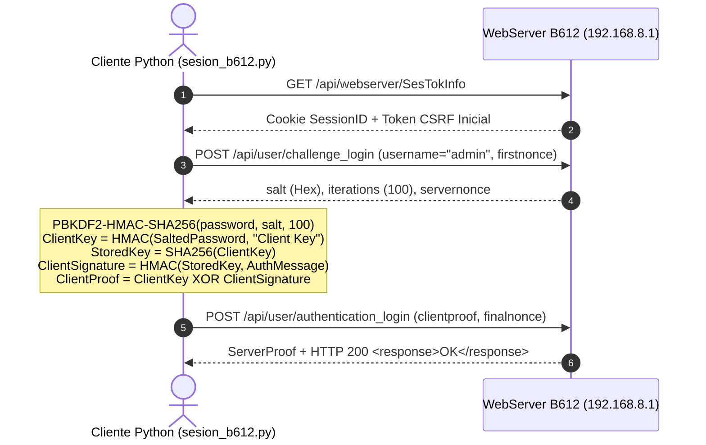
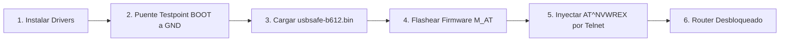

<div align="center">

# 📡 Huawei B612s-51d: Security Research, Reverse Engineering & SIM-Lock Unlock Suite
### 🇨🇱 Auditoría de Seguridad, Ingeniería Inversa y Métodos de Desbloqueo de Red (SIM-Lock V5) para Router 4G LTE Huawei B612s-51d (Entel Chile CUST-C110)

[](https://github.com/davidarellano210322-glitch/huawei-b612-unlock)
[-8A2BE2?style=for-the-badge)](https://github.com/davidarellano210322-glitch/huawei-b612-unlock)
[-orange?style=for-the-badge)](https://github.com/davidarellano210322-glitch/huawei-b612-unlock)
[](https://github.com/davidarellano210322-glitch/huawei-b612-unlock)
[-green?style=for-the-badge)](https://github.com/davidarellano210322-glitch/huawei-b612-unlock)
[](https://github.com/davidarellano210322-glitch/huawei-b612-unlock)

<br/>

[📖 Documentación Completa](./documentacion/README.md) •
[📱 Estado del Router](./documentacion/01_ESTADO_DEL_DISPOSITIVO.md) •
[🔬 Ingeniería Inversa](./documentacion/02_ANALISIS_REVERSE_ENGINEERING.md) •
[🛡️ Auditoría WebUI](./documentacion/03_AUDITORIA_WEBUI_Y_ENDPOINTS.md) •
[🚀 Guías de Desbloqueo](./documentacion/04_GUIAS_DE_DESBLOQUEO_VIABLES.md) •
[🛠️ Catálogo de Scripts](./documentacion/05_CATALOGO_SCRIPTS_HERRAMIENTAS.md)

---

</div>

## 📌 1. Resumen Ejecutivo del Proyecto

Este repositorio documenta la investigación técnica, ingeniería inversa y auditoría de seguridad realizada sobre el módem/router 4G LTE **Huawei B612s-51d** con firmware de fábrica provisto por **Entel Chile** (`11.192.00.00.110` / CUST-B00C110).

El objetivo fue diagnosticar la viabilidad técnica de liberar el dispositivo para su uso en redes celulares de operadores alternativos (**WOM**, **Movistar**, **Claro**) preservando el módem y evitando el bloqueo irreversible de los intentos de NCK restantes.



---

## 📊 2. Ficha Técnica y Telemetría en Vivo

```
================================================================================
 IDENTIFICACIÓN Y ESTADO DEL HARDWARE EN TIEMPO REAL
================================================================================
 Modelo Comercial      : Huawei 4G Router B612s-51d
 Arquitectura / SoC    : HiSilicon Balong 711 (Familia Módem V7R11)
 Código IMEI           : 864596030624094
 Firmware Base         : 11.192.00.00.110 (Customización CUST-B00C110 Entel)
 WebUI Version         : 11.100.01.00.110 (Versión despojada / Stripped)
 Bandas Soportadas     : FDD LTE Bandas B2, B4 (AWS), B7, B28 (700 MHz)
================================================================================
 ESTADO DEL SUBSISTEMA CELULAR (SIM WOM INSERTADA)
================================================================================
 SimState              : 257  --> SIM detectada físicamente, lista sin PIN
 SimLockEnable         : 1    --> Bloqueo de operador ACTIVO
 SimLockVersion        : 5    --> Algoritmo Huawei SIM-Lock V5
 SimLockRemainTimes    : 2    --> ⚠️ CRÍTICO: 2/10 intentos disponibles
 ConnectionStatus      : 902  --> Desconectado (Rechazo por bloqueo de red)
 PLMN Registrado       : [Vacío] (El router no registra red celular)
================================================================================
```

---

## 🔐 3. Autenticación Criptográfica SCRAM-SHA256 (HiLink V5)

El router implementa autenticación estricta bajo la norma **RFC 5802** (**SCRAM-SHA256**). Se desarrolló un motor autónomo en Python ([`sesion_b612.py`](./sesion_b612.py)) capaz de resolver el handshake:



---

## 🔬 4. Hallazgos Clave e Ingeniería Inversa

### 🧪 Hallazgo 1: Desmitificación de `unlock_v7r11_2018-07-14.exe`
Al desensamblar la popular utilidad rusa `unlock_v7r11`, se descubrió que:
* **No es un generador de códigos NCK:** Es un instalador de *Indigo Rose Setup Factory*.
* **Payload interno:** Contiene `adb.exe` y un script por lotes `go.cmd`.
* **Mecanismo real:** Se conecta vía ADB al puerto `5555`, detiene el daemon de seguridad `add_param` y sobreescribe la celda de bloqueo en la memoria no volátil:
  ```bash
  atc AT^NVWREX=8268,0,12,1,0,0,0,2,0,0,0,A,0,0,0
  ```
* **Conclusión:** No existe cálculo matemático V5 offline. El autor recurrió a la inyección en NVRAM porque los códigos solo existen en las bases de datos del operador.

### 🌐 Hallazgo 2: Auditoría del WebUI y Error `100003`
* Se probó el mecanismo que utiliza `inst_webui` haciendo POST multipart a `/api/filemanager/upload` con cabeceras `cur_path=OU:<firmware.zip>`.
* **Resultado en vivo:** El router responde en 0 segundos con `<error><code>100003</code></error>`.
* **Causa:** El firmware `11.192.00.00.110` de Entel tiene el backend de subida de archivos totalmente eliminado del binario webserver.

---

## 🚀 5. Matriz de Soluciones y Métodos Viables

| Método | Tipo | Tiempo Est. | Riesgo Intentos NCK | Viabilidad | Requisitos |
| :--- | :---: | :---: | :---: | :---: | :--- |
| **A. Modo Testpoint USB** | Hardware / Flasheo | ~30-40 min | **Cero (No gasta intentos)** | **100% Confirmado** | Cable USB, destornillador, pinza, PC con Windows |
| **B. Solicitud NCK Entel** | Legal / Oficial | ~10-15 min | **Cero (Código oficial)** | **100% Gratis por Ley** | Llamar al `800 367 626` con IMEI `864596030624094` |
| **C. Inyección Web Local** | Software / WebUI | N/A | N/A | **0% Inviable** | Bloqueado por firmware Entel C110 (Error 100003) |
| **D. Calculadores Web V5** | Fuerza Bruta | N/A | **Peligro Extremo (Hard-lock)** | **0% Falso** | No existen calculadores matemáticos V5 |

---

## 🧰 6. Procedimientos de Desbloqueo Paso a Paso

### 🛠️ VÍA A: Flasheo USB con Kit Balong (Recomendada Autónoma)



1. **Instalar Drivers:** Ejecutar los instaladores de [`kit_flasheo/drivers/`](./kit_flasheo/drivers/) e importar `Windows10_fix.reg`.
2. **Entrar en Modo BOOT (Modo Aguja):**
   * Desconectar la corriente. Abrir la carcasa (4 tornillos).
   * Cortocircuitar el punto **BOOT (Testpoint)** con **GND** (tierra/blindaje).
   * Conectar el cable USB a la PC y enchufar la corriente. Esperar 3 segundos y soltar el puente.
   * Verificar en el *Administrador de Dispositivos* el puerto `HUAWEI Mobile Connect - 3G PC UI Interface` (VID_12D1 & PID_1443).
3. **Cargar Cargador Seguro:**
   ```cmd
   cd kit_flasheo
   balong_usbdload.exe usbsafe-b612.bin
   ```
4. **Flashear Firmware con Soporte M_AT:**
   ```cmd
   balong_flash.exe -gd B612_UPDATE_81.201.01.01.234_sec_M_AT_V3.9.bin
   ```
5. **Liberación Final por Telnet:**
   Conectar el router por cable LAN a la PC y ejecutar:
   ```bash
   python desbloquear_b612.py
   ```
   *(El script enviará automáticamente el comando de anulación `atc at^nvwrex=8268,0,12,1,0,0,0,2,0,0,0,a,0,0,0` y reiniciará el módem).*

---

### 🏛️ VÍA B: Desbloqueo Legal por Código NCK (Entel Chile / Subtel)

1. Llamar a Entel al **`800 367 626`** o acudir a una sucursal presencial.
2. Indicar que solicitas el **Código de Desbloqueo de Red (NCK)** para tu módem **Huawei B612s-51d** con IMEI **`864596030624094`**.
3. **Fundamento legal:** Resolución Exenta de la **SUBTEL** (el desbloqueo es gratuito y obligatorio para todo equipo terminal móvil en Chile).
4. Una vez obtenido el código, ingresarlo de forma segura con el script:
   ```bash
   python ingresar_codigo.py <TU_CODIGO_NCK>
   ```

---

## 🗂️ 7. Índice de Archivos y Documentación

```
huawei-b612-unlock/
├── README.md                                    # Este documento (Hub principal)
├── historial                                    # Resumen rápido del estado del router
├── .gitignore                                   # Exclusión de binarios y temporales
├── documentacion/                               # Suite documental exhaustiva
│   ├── README.md                                # Índice del dossier técnico
│   ├── 01_ESTADO_DEL_DISPOSITIVO.md             # Telemetría, hardware, SCRAM y SIM WOM
│   ├── 02_ANALISIS_REVERSE_ENGINEERING.md       # Ingeniería inversa de unlock_v7r11 y NVRAM
│   ├── 03_AUDITORIA_WEBUI_Y_ENDPOINTS.md        # Mapeo de 40+ endpoints y análisis 100003
│   ├── 04_GUIAS_DE_DESBLOQUEO_VIABLES.md        # Manuales paso a paso de desbloqueo
│   ├── 05_CATALOGO_SCRIPTS_HERRAMIENTAS.md      # Documentación de scripts en Python
│   ├── 06_CRONOLOGIA_E_HISTORIAL_INVESTIGACION.md # Bitácora de pruebas cronológica
│   └── 07_FUENTES_Y_REFERENCIAS.md              # Créditos 4PDA, Capa9, Subtel y UCSC
├── kit_flasheo/                                 # Toolchain de flasheo por USB
│   ├── balong_flash.exe                         # Flasheador de bajo nivel Balong
│   ├── balong_usbdload.exe                      # Cargador de arranque en RAM
│   ├── Balong_USB_Downloader_1.0.1.10.exe       # Interfaz gráfica de flasheo
│   ├── usbsafe-b612.bin                         # Safe bootloader para B612
│   ├── README_PASOS.txt                         # Instrucciones de consola
│   └── drivers/                                 # Drivers FC Serial y Huawei Datacard
├── sesion_b612.py                               # Motor de sesión HiLink SCRAM-SHA256
├── desbloquear_b612.py                          # Inyector Telnet para bypass NVRAM 8268
├── ingresar_codigo.py                           # Validador e inyector seguro de código NCK
├── webui_update.py                              # Emulador de subida multipart WebUI
├── sonda_b612.py                                # Extractor de telemetría del router
├── endpoints_b612.py                            # Escáner y fuzzer de API HiLink
├── ports_deep.py                                # Escáner de puertos TCP y servicios
├── simwatch.py                                  # Monitor continuo de eventos SIM
└── test_scram.py                                # Suite de pruebas criptográficas SCRAM
```

---

## ⚠️ 8. Advertencias de Seguridad Críticas

> [!CAUTION]
> **No probar códigos al azar:**
> El módem cuenta únicamente con **2 intentos restantes de NCK** (`SimLockRemainTimes = 2`). Ingresar 2 códigos erróneos provocará el bloqueo permanente del contador (*hard-lock*).

> [!WARNING]
> **No realizar Factory Reset post-desbloqueo:**
> Si el router es desbloqueado mediante escritura de NVRAM (`AT^NVWREX=8268`), ejecutar un restablecimiento de fábrica desde el botón físico o la interfaz web corromperá el registro de calibración, ocasionando la pérdida de la señal celular.

---

<div align="center">

Desarrollado para fines de investigación de seguridad y preservación de hardware • 2026

</div>
