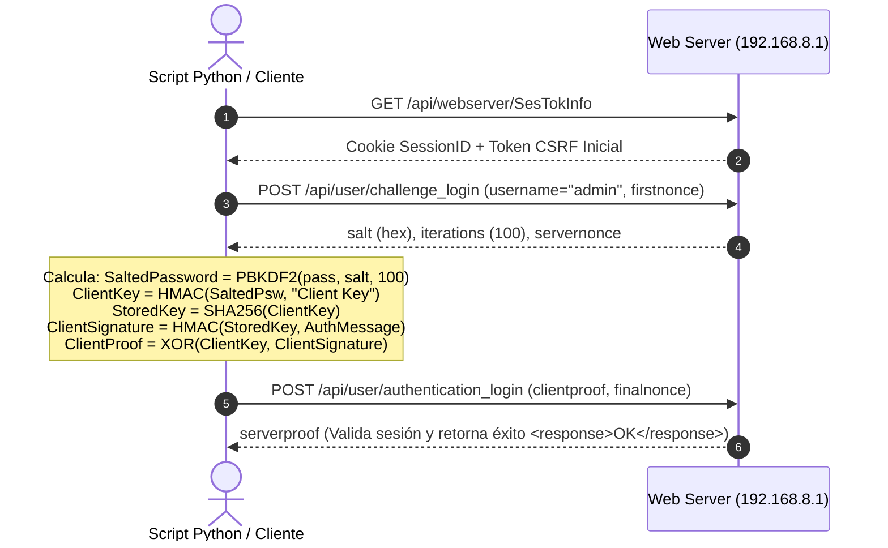

# 📱 01. Estado del Dispositivo y Diagnóstico en Vivo

Este documento consolida las especificaciones de hardware, versión de firmware, arquitectura criptográfica de autenticación y estado del bloqueo de red obtenido mediante sondeo directo sobre el router **Huawei B612s-51d**.

---

## 1. Especificaciones Generales de Hardware

| Parámetro | Detalle |
| :--- | :--- |
| **Modelo Comercial** | Huawei 4G Router B612s-51d |
| **Operador de Origen** | Entel Chile |
| **SoC / Módem Móvil** | HiSilicon Balong 711 (Familia V7R11) |
| **Categoría LTE** | LTE Cat.6 (hasta 300 Mbps bajada / 50 Mbps subida) |
| **Bandas Frecuencia** | FDD LTE: B2 (1900 MHz), B4 (AWS 1700/2100 MHz), B7 (2600 MHz), B28 (700 MHz) |
| **Interfaces Físicas** | 3x LAN RJ-45 (10/100/1000), 1x LAN/WAN RJ-45, 1x RJ-11 (Voz CS/VoLTE), 1x Micro-SIM, 2x SMA Antenas Externas |
| **Puerto USB Interno** | Presente en placa base (utilizado para modo de recuperación / Balong Bootrom) |

---

## 2. Parámetros de Software y Firmware

* **Versión de Software Base:** `11.192.00.00.110`
* **Customización (CUST):** `CUST-B00C110` (Build exclusiva de Entel Chile)
* **WebUI Version:** `11.100.01.00.110` (Build despojada / *stripped*, sin soporte de actualización local por interfaz de usuario)
* **Linux Kernel / OS:** Linux 3.10.x embebido bajo arquitectura ARM (Balong V7R11)

---

## 3. Diagnóstico del Bloqueo SIM (Lectura en Tiempo Real)

Las pruebas realizadas con una tarjeta Micro-SIM del operador **WOM Chile** arrojaron los siguientes valores mediante llamadas autenticadas a `/api/pin/simlock`, `/api/pin/status` y `/api/monitoring/status`:

```json
{
  "SimState": 257,
  "SimLockEnable": 1,
  "SimLockVersion": 5,
  "SimLockRemainTimes": 2,
  "ConnectionStatus": 902,
  "CurrentNetworkType": 0,
  "ServiceStatus": 0,
  "PLMN": "",
  "simlockStatus": 1
}
```

### Interpretación de Valores:
1. **`SimState = 257`**: La ranura SIM detecta físicamente el chip WOM. No requiere PIN de tarjeta SIM (`SimPinStatus = 0`), lo que confirma que el chip es operativo y está listo para autenticar.
2. **`SimLockEnable = 1`**: El subsistema de seguridad del módem tiene el bloqueo de red de operador **ACTIVO**.
3. **`SimLockVersion = 5`**: El mecanismo de verificación corresponde al algoritmo **Huawei SIMLock V5** (basado en par de llaves y secretos almacenados en la partición NVRAM del módem).
4. **`SimLockRemainTimes = 2`**: **Nivel de alerta crítico.** De los 10 intentos originales otorgados por fábrica, solo restan **2 intentos**.
5. **`ConnectionStatus = 902` & `ServiceStatus = 0`**: El router no puede registrarse en la red celular ni negociar contexto PDP/IP debido a la restricción del firmware.
6. **`PLMN = ""`**: No se asocia a la red WOM (MCC/MNC 73009) debido a la denegación por bloqueo de red.

---

## 4. Arquitectura de Autenticación HiLink (SCRAM-SHA256)

El firmware `11.192.00.00.110` implementa autenticación estricta basada en el protocolo RFC 5802 (**SCRAM-SHA256**), reemplazando los esquemas antiguos basados en MD5 o SHA256 simple (`base64(sha256(user + base64(sha256(pass)) + token))`).



### Implementación Lograda:
Se diseñó y validó el módulo en Python [`sesion_b612.py`](../sesion_b612.py) capaz de realizar el handshake criptográfico SCRAM-SHA256 de forma autónoma, manteniendo la sesión viva mediante rotación dinámica de tokens de verificación `__RequestVerificationToken`.

---
[⬅️ Volver al README](./README.md) | [Siguiente: Análisis e Ingeniería Inversa ➡️](./02_ANALISIS_REVERSE_ENGINEERING.md)
