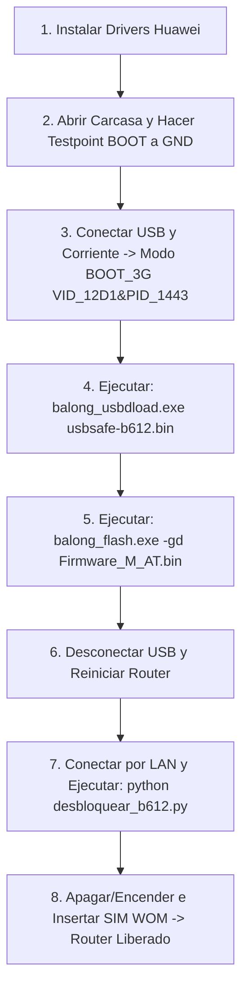

# 🚀 04. Guías de Desbloqueo Viables y Verificadas

Tras descartar los vectores web y los falsos calculadores offline, este documento describe las **2 únicas rutas 100% efectivas** para desbloquear el Huawei B612s-51d.

---

## 🛠️ RUTA A: Flasheo USB mediante Testpoint (Método Autónomo)

Este método permite modificar la celda NVRAM `8268` directamente mediante Telnet/AT sin gastar los 2 intentos de NCK restantes.



### Paso a Paso Detallado:

#### Paso 1: Instalación de Drivers (Directorio `kit_flasheo/drivers`)
1. Ejecutar `FC_Serial_Driver_Setup.exe`.
2. Ejecutar `HUAWEI_DataCard_Driver_6.00.08.00_Setup.exe`.
3. En Windows 10/11: Hacer doble clic en `Windows10_fix.reg` para habilitar puertos serie virtuales Huawei.
4. Reiniciar la computadora.

#### Paso 2: Entrada en Modo de Emergencia (Modo de la Aguja / Testpoint)
1. Desenchufar la fuente de poder del router.
2. Retirar los 4 tornillos de la carcasa trasera y extraer la placa base.
3. Localizar el punto **BOOT (Testpoint)** en la placa madre:
   * Hacer puente con una pinza metálica o cable fino entre el punto **BOOT** y una zona de tierra (**GND / blindaje metálico**).
4. Conectar el cable USB del router al PC.
5. Conectar el cable de corriente del router y esperar 2 a 3 segundos.
6. Retirar el puente del Testpoint.
7. Verificar en el *Administrador de Dispositivos de Windows*: debe figurar `HUAWEI Mobile Connect - 3G PC UI Interface` o un dispositivo USB con `VID_12D1 & PID_1443` con puerto asignado (ejemplo: `COM33`).

#### Paso 3: Carga del Bootloader Seguro
Abrir la terminal dentro de la carpeta `kit_flasheo/` y ejecutar:
```cmd
balong_usbdload.exe usbsafe-b612.bin
```
*(El módem reiniciará su interfaz USB y expondrá dos puertos COM de flasheo).*

#### Paso 4: Flasheo del Firmware con Soporte M_AT / Telnet
Ejecutar el comando de flasheo (duración aproximada: ~8-10 minutos):
```cmd
balong_flash.exe -gd B612_UPDATE_81.201.01.01.234_sec_M_AT_V3.9.bin
```
> [!IMPORTANT]
> No desconectar la alimentación ni el cable USB durante el proceso. La barra de progreso debe avanzar de forma sostenida hasta indicar `Flashed successfully`.

#### Paso 5: Primer Arranque y Liberación por Telnet
1. Desconectar el cable USB y apagar el router por 5 segundos.
2. Encender el router y conectar la PC a uno de los puertos LAN con cable de red.
3. Abrir la terminal en la raíz del proyecto y ejecutar:
```bash
python desbloquear_b612.py
```
Este script se conecta al puerto Telnet `5510`/`23` y despacha el comando de anulación de SIM-Lock:
```text
atc at^nvwrex=8268,0,12,1,0,0,0,2,0,0,0,a,0,0,0
```
4. Apagar y encender el router. Colocar el chip WOM. El router se registrará en la red LTE con estado de conexión `901 / Conectado`.

---

## 🏛️ RUTA B: Desbloqueo Legal Oficial Entel (Vía NCK Gratuita)

En Chile, por disposición de la **Subsecretaría de Telecomunicaciones (SUBTEL)**, las compañías operadoras están obligadas por ley a suministrar el código de desbloqueo de red (NCK) de forma **inmediata y sin costo**, sin importar la antigüedad del equipo ni la existencia de boleta.

### 1. Contacto con el Operador
* **Teléfono de Atención:** `800 367 626` (Llamada gratuita desde cualquier red) o presencial en Sucursales Entel.
* **Datos a Presentar:**
  * Modelo del equipo: `Huawei B612s-51d`
  * Código IMEI: `864596030624094`
  * Motivo: "Solicitud de código de desbloqueo de red (NCK) para uso en otra compañía".

### 2. Ingreso Seguro del Código NCK
Para evitar agotar los 2 intentos restantes por errores tipográficos en el navegador, se recomienda utilizar el script automatizado:

```bash
python ingresar_codigo.py <TU_CODIGO_NCK_DE_8_O_16_DIGITOS>
```

El script verificará previamente la sesión, el token CSRF, validará la respuesta del módem y confirmará si el desbloqueo fue aceptado:
```xml
<response>OK</response>
```

---
[⬅️ Anterior: Auditoría WebUI](./03_AUDITORIA_WEBUI_Y_ENDPOINTS.md) | [Siguiente: Catálogo de Scripts y Herramientas ➡️](./05_CATALOGO_SCRIPTS_HERRAMIENTAS.md)
