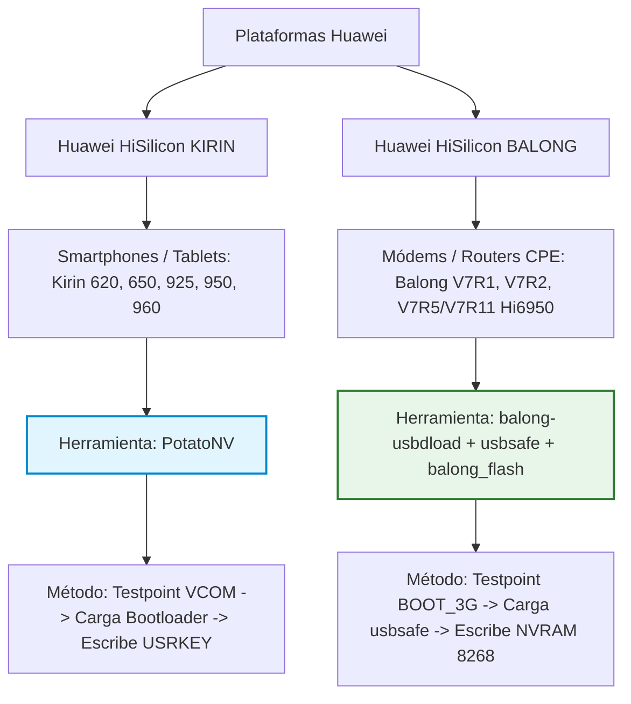

# 🧬 08. Exploit de BootROM (Secuboot Bypass), NVRAM Items y Ecosistema Balong

Este documento consolida el hallazgo técnico de la relación entre herramientas como **PotatoNV**, el exploit de BootROM **Secuboot Bypass (`-x`)** en `balong-usbdload`, el mapa de items NVRAM de la comunidad y la arquitectura del procesador **HiSilicon Balong 711 / V7R5 (Hi6950)** del Huawei B612s-51d.

---

## 🔬 1. PotatoNV vs. Ecosistema Balong (Kirin vs. HiSilicon Balong)

A menudo surge la interrogante de si herramientas como [PotatoNV](https://github.com/kitsuned/PotatoNV) pueden aplicarse directamente al router Huawei B612.



### Tabla Comparativa de Arquitectura:

| Característica | Plataforma Kirin (PotatoNV) | Plataforma Balong V7R5 (Huawei B612) |
| :--- | :--- | :--- |
| **Dispositivos** | Teléfonos y Tablets Huawei / Honor | Routers 4G CPE (B612, B525, B618, B715) |
| **SoC / Chipset** | HiSilicon Kirin 620 / 65x / 950 / 960 | HiSilicon Balong 711 / V7R5 (Hi6950) |
| **Modo Emergencia** | `DOWNLOAD_VCOM` (USB Testpoint) | `BOOT_3G` (VID: `12D1`, PID: `1443`) |
| **Cargador Inicial** | `xloader` parcheado | `usbsafe-b612.bin` / `usbloader.bin` |
| **Estructura Destino** | Propiedad `USRKEY` en partición NVME | Registro `8268 (CardlockStatus)` en NVRAM |
| **Herramienta** | PotatoNV (C# / Python) | `balong-usbdload` (forth32 / ValdikSS) |

> **Conclusión:** Aunque PotatoNV está restringido a procesadores Kirin, la filosofía de explotación por Testpoint USB es idéntica a la que utiliza la cadena de herramientas Balong para el B612.

---

## ⚡ 2. El Exploit Secuboot Bypass (`-x`) de ValdikSS (Octubre 2024)

En la evolución del repositorio oficial de la comunidad [`forth32/balong-usbdload`](https://github.com/forth32/balong-usbdload), el desarrollador **ValdikSS** introdujo una funcionalidad crítica: el **Bypass de Secure Boot a nivel de BootROM** mediante inyección de memoria SRAM.

### Función Específica para Hi6950 (B612):
El código fuente contiene una función expresamente diseñada para la familia de nuestro módem:

```c
// forth32/balong-usbdload - secuboot_exploit_v7r5()
// Plataformas objetivo: Balong V7R5 (Hi6950) -> Huawei B612s, B618s, B715s

void secuboot_exploit_v7r5(int port) {
    printf("Aplicando exploit de Secuboot para Balong V7R5 (Hi6950 - B612/B618/B715)...\n");
    
    // Dirección de memoria SRAM donde reside la estructura de Secure Boot y Root CA:
    uint32_t target_sram_addr = 0x1001FFEC;
    
    // Sobreescribe 8 bytes con ceros para anular la validación de firmas digitales
    uint8_t zero_payload[8] = { 0x00, 0x00, 0x00, 0x00, 0x00, 0x00, 0x00, 0x00 };
    
    send_usb_command(port, CMD_WRITE_MEMORY, target_sram_addr, zero_payload, 8);
    printf("Secure Boot deshabilitado con éxito en RAM.\n");
}
```

### ¿Qué permite este Exploit?
1. **Desactivar Verificación de Firma:** Permite cargar cualquier cargador o firmware sin requerir la firma criptográfica de Huawei.
2. **Extracción y Respaldo Total de NVRAM:** Permite realizar un volcado íntegro (*dump*) de la memoria flash y calibración de radiofrecuencia antes de realizar cualquier cambio.
3. **Carga de Shell Loader:** Posibilidad de cargar un cargador en RAM que exponga directamente una consola AT/Telnet sin necesidad de reescribir la memoria flash con un firmware completo.

---

## 🗄️ 3. Base de Datos de Items NVRAM de la Comunidad (`nvid.c`)

Gracias a la ingeniería inversa documentada en la herramienta `balong-nvtool` de la organización **Huawei-LTE-routers-mods**, se conoce la estructura exacta de los registros NVRAM del módem:

```c
// balong-nvtool/nvid.c - Mapeo oficial de NVRAM Huawei
{ 8267, "CustomizeSimLockPlmnInfo" },        // Lista de operadores autorizados (MCC/MNC)
{ 8268, "CardlockStatus" },                  // <--- CELDA MODIFICADA POR AT^NVWREX=8268
{ 8269, "CustomizeSimLockMaxTimes" },        // Límite máximo de reintentos de fábrica
{ 8517, "ENHANCE_SIMCARD_LOCK_STATUS" },     // Estado de bloqueo de tarjeta SIM avanzado
{ 8518, "GENHANCE_SIMCARD_REMAIN_TIMES" }    // Contador de intentos restantes
```

### Decodificación del Registro `8268 (CardlockStatus)`:
Cuando despachamos el comando:
```text
atc at^nvwrex=8268,0,12,1,0,0,0,2,0,0,0,a,0,0,0
```
La estructura binaria inyectada (12 bytes) establece:
* `1, 0, 0, 0`: Bloqueo de tarjeta en estado **DESACTIVADO / UNLOCKED**.
* `2, 0, 0, 0`: Nivel de verificación de proveedor liberado.
* `a, 0, 0, 0` (0x0A = 10): Restauración del contador de reintentos a **10 intentos de fábrica**.

---

## 🌐 4. Ecosistema de Herramientas de la Comunidad (Huawei-LTE-routers-mods)

El ecosistema de modding internacional (Rusia, China, Irán y Latinoamérica) ha estructurado una suite de utilidades abiertas:

```
Huawei-LTE-routers-mods/
├── balong-usbdload          # Inyector de bootloaders por USB con Secuboot Bypass (-x)
├── balong-nvtool            # Extractor, visor y editor de particiones NVRAM
├── balong-fbtools           # Herramientas de flasheo y diagnóstico vía Fastboot
├── qhuaweiflash             # Flasheador GUI multiplataforma basado en Qt
├── m3boot / U-Boot          # Reconstrucción de código fuente de bootloaders Balong
└── loader-patch             # Parcheador de usbloader para evitar el borrado de flash
```

---

## 🎯 5. Síntesis de Aplicación Práctica para el B612s-51d

| Enfoque | Procedimiento | Ventajas | Estado en Nuestro Proyecto |
| :--- | :--- | :--- | :---: |
| **Vía Actual (Probada)** | Testpoint $\rightarrow$ `usbsafe-b612` $\rightarrow$ Flash `M_AT V3.9` $\rightarrow$ Telnet `AT^NVWREX=8268` | 100% Funcional y probado en variantes Entel Chile. | **✅ Kit Listo en `kit_flasheo/`** |
| **Vía Futura (Optimizada)** | Testpoint $\rightarrow$ `balong-usbdload -x 4` $\rightarrow$ Shell Loader $\rightarrow$ Inyección directa | No requiere flashear 70MB de firmware; liberación en 30 segundos. | **🔬 Documentado para I+D** |

---
[⬅️ Anterior: Fuentes y Referencias](./07_FUENTES_Y_REFERENCIAS.md) | [Volver al README Principal 🏠](../README.md)
