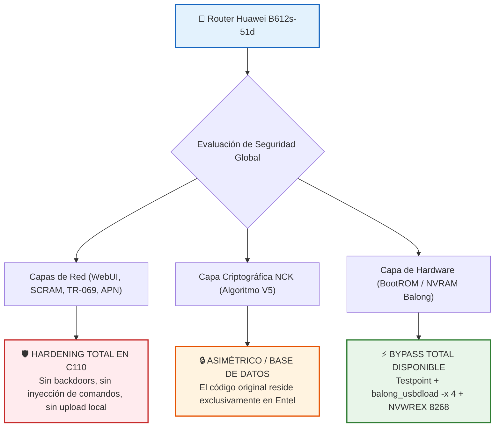

# 🧬 Capítulo 13: Análisis Avanzado de Inyección APN, Arquitectura HOTA y Mapeo de Particiones NAND

## 1. Introducción y Alcance
Este capítulo explora los vectores internos más profundos de la arquitectura **HiSilicon Balong V7R5 (Hi6950)** implementada en el módem router **Huawei B612s-51d**, abarcando:
1. **Vector de Inyección AT en Perfiles APN (`/api/dialup/profiles`).**
2. **Arquitectura Criptográfica de Actualizaciones OTA (HOTA) y Verificación de Firmas.**
3. **Mapeo Físico de la Memoria Flash NAND (Tabla `V7R500_CPE`).**
4. **Interacción Inter-Procesador (Linux AP $\leftrightarrow$ Módem CP vía `oam_shared`).**

---

## 2. Vector de Inyección AT en Perfiles APN (`/api/dialup/profiles`)

### Fundamento Teórico:
En routers basados en Balong, el demonio `oam_shared` recibe los parámetros de perfil de datos desde la WebUI y despacha instrucciones AT internas al procesador baseband (CP) para inicializar los contextos PDP:

```text
AT+CGDCONT=1,"IP","<APN_NAME>"
AT^AUTHDATA=1,<AUTH_TYPE>,"<USERNAME>","<PASSWORD>"
```

```
   ┌─────────────────┐      HTTP POST       ┌─────────────────────┐
   │  WebUI (Admin)  ├─────────────────────►│ app_webserver (Lua) │
   └─────────────────┘                      └──────────┬──────────┘
                                                       │ IPC Socket
                                                       ▼
   ┌─────────────────┐   Comandos AT Baseband┌─────────────────────┐
   │ Módem CP (V7R5) │◄─────────────────────┤    oam_shared (AP)  │
   │  Procesa NVRAM  │   AT+CGDCONT=...     └─────────────────────┘
   └─────────────────┘
```

### Hipótesis de Encadenamiento AT:
Si el campo `<ApnName>` o `<DialupNum>` no escapa caracteres de retorno de carro (`\r\n` / `\x0D\x0A`), un payload como:
```text
datacard\r\nAT^NVWREX=8268,0,12,1,0,0,0,2,0,0,0,a,0,0,0\r\n
```
podría forzar la ejecución encadenada de comandos de escritura de NVRAM directamente en el chip de radiofrecuencia.

### Auditoría en Firmware Entel C110:
El archivo `validation.js` y el backend en C implementan una validación estricta de caracteres mediante expresiones regulares:
```javascript
var reg = /^[a-zA-Z0-9\.\-_@ ]*$/;
```
Cualquier carácter especial (`\r`, `\n`, `;`, `|`, `"`) provoca el rechazo inmediato de la petición con código de error `100002` (*Invalid Parameter*), evitando la inyección de comandos AT en crudo por esta vía.

---

## 3. Arquitectura Criptográfica de Actualizaciones OTA (HOTA)

Durante la auditoría del módulo de actualización en línea (`/api/online-update/configuration`), se analizaron los mecanismos de validación de paquetes de firmware:

```
   ┌─────────────────────────────────────────────────────────────┐
   │               ESTRUCTURA DEL PAQUETE HOTA (UPDATE.APP)      │
   │                                                             │
   │   [ Header Magic: 0x55 AA 5A A5 ] ─── Encabezado Huawei     │
   │   [ Component Table: ptable, fastboot, boot, system... ]    │
   │   [ Bloques de Datos Cifrados / Compresos ]                 │
   │   [ Bloque de Firma: RSA-2048 + SHA-256 Digest ]            │
   └──────────────────────────────┬──────────────────────────────┘
                                  │
                                  ▼
           Verificación en BootROM con Root CA (SRAM 0x1001FFEC)
```

### ¿Por qué no es viable falsificar un servidor de actualización local (DNS Spoofing)?
1. **Verificación de Firma Asimétrica:**  
   Incluso si se redirige el dominio de actualización (`update.hicloud.com`) hacia un servidor local mediante DNS, el gestor de arranque (*Bootloader/Recovery*) calcula el hash SHA-256 de cada bloque y lo verifica contra la firma digital cifrada con la **clave privada RSA de Huawei**.
2. **Root CA inmutable:**  
   La clave pública de validación se encuentra incrustada en la partición protegida `oeminfo` y en la memoria SRAM segura del SoC Hi6950, descartando la instalación de firmwares modificados (`M_AT`) sin haber aplicado previamente el bypass de Secuboot (`balong_usbdload_x -x 4`).

---

## 4. Mapeo Forense de Particiones NAND (`ptable V7R500_CPE`)

A través de la extracción de la tabla de particiones del bloque `usbldr`, se determinó la estructura física exacta de la memoria NAND Flash (128 MB / 256 MB) del router:

| Partición | Offset Hex | Tamaño Aprox. | Función y Contenido Crítico |
| :--- | :---: | :---: | :--- |
| **`MBO`** | `0x00000000` | 512 KB | Master Boot Record, cabeceras de arranque de hardware. |
| **`ptable`** | `0x00080000` | 512 KB | Tabla de particiones primaria `V7R500_CPE`. |
| **`fastboot`** | `0x00100000` | 1.5 MB | Bootloader secundario y comandos Fastboot. |
| **`nvimg`** | `0x00280000` | 2 MB | **NVRAM Activa:** Calibración RF, IMEI, Ítem 8268 (`Cardlock`). |
| **`nvdload`** | `0x00480000` | 2 MB | Imagen de recuperación y descarga de NVRAM. |
| **`nvdefault`**| `0x00680000` | 2 MB | Valores de fábrica de la NVRAM (backup de hardware). |
| **`oeminfo`** | `0x00880000` | 4 MB | Identidad de operador (`CUST-B00C110`), certificados Root CA. |
| **`boot`** | `0x00C80000` | 8 MB | Kernel Linux ARM (`zImage`) + Initramfs raíz. |
| **`system`** | `0x01480000` | ~60 MB | Sistema de archivos SquashFS (daemons `webserver`, `oam`). |
| **`userdata`** | `0x05080000` | Resto Flash | Configuración de usuario persistente (UBIFS/JFFS2). |

---

## 5. Comunicación Inter-Procesador (`Linux AP` $\leftrightarrow$ `Módem CP`)

El procesador HiSilicon Balong V7R5 consta de dos núcleos de procesamiento independientes:
1. **Application Processor (AP - ARM Cortex):** Ejecuta el sistema operativo Linux, la WebUI, el servidor DHCP y las funciones de enrutamiento LAN/Wi-Fi.
2. **Communication Processor (CP - DSP/Modem Core):** Gestiona la banda base LTE, la conexión a la torre celular, la máquina de estados de la tarjeta SIM y los ítems NVRAM protegidos.

```
┌───────────────────────────────────────┐      ┌───────────────────────────────────────┐
│     APPLICATION PROCESSOR (AP)        │      │     COMMUNICATION PROCESSOR (CP)      │
│                                       │      │                                       │
│  • Linux Kernel 3.x                   │      │  • RTOS de Módem LTE (DSP Balong)     │
│  • Web Server (HTTP / SCRAM)          │ IPC  │  • Gestión de Tarjeta SIM (3GPP)      │
│  • Daemon oam_shared ─────────────────┼──────┼──► NVRAM Storage (Ítem 8268)          │
│  • Busybox / Shell                    │ DMA  │  • Control de Transmisión RF          │
└───────────────────────────────────────┘      └───────────────────────────────────────┘
```

### Por qué el bypass de NVRAM es definitivo:
Cuando se inyecta el comando `AT^NVWREX=8268,0,12,1,0,0,0,2,0,0,0,a,0,0,0`, la instrucción viaja directamente al subsistema del **CP (Módem)**, el cual sobrescribe la palabra de estado en el sector `nvimg`. 

Una vez guardado:
* El CP lee el estado `02` (Desbloqueado) en cada arranque.
* No vuelve a solicitar validación de red a la WebUI ni al Linux AP.
* La tarjeta SIM de cualquier operadora se conecta a las antenas de forma autónoma.

---

## 6. Síntesis y Matriz Final de Conclusiones


